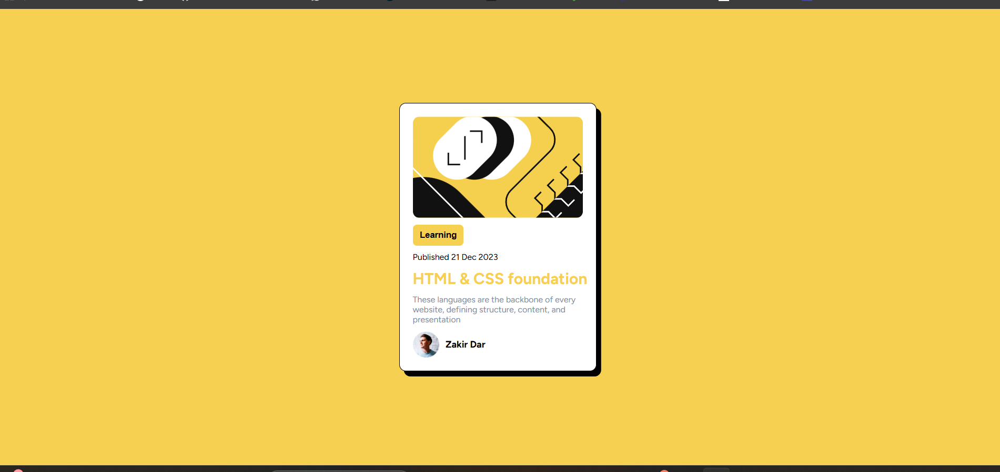

Frontend Mentor - Blog Preview Card Solution

This is my solution to the Blog Preview Card challenge on Frontend Mentor. The goal of this challenge was to create a responsive blog preview card using only HTML and CSS.

---

## Table of Contents:
1. [Overview](#overview)
2. [Built With](#built-with)
3. [What I Learned](#what-i-learned)
4. [Continued Development](#continued-development)
5. [Screenshot](#screenshot)
6. [Author](#author)

---

## 1. Overview:
- This project features a responsive blog preview card component with clean design and proper spacing.
- The card adjusts smoothly to different screen sizes.

### Screenshot:
- **Desktop View:**  
  

- **Mobile View:**  
  

---

## 2. Built With:
- HTML5
- CSS3
- Flexbox for layout
- Responsive design techniques

---

## 3. What I Learned:
- Improved my skills in using CSS Flexbox to center and align elements.
- Learned how to use scalable units (rem, vw) to create responsive text and layouts.

---

## 4. Continued Development:
- I plan to practice more with CSS Grid and explore CSS animations to enhance user experience.

---

## 5. Screenshot:
- Desktop View:  
  

- Mobile View:  
  

---

## 6. Author:
- **Frontend Mentor** - [zakir dar](https://www.frontendmentor.io/profile/zakir_dar)
- **GitHub** - [kmrzakir](https://github.com/kmrzakir)

---

### Links

- **Solution URL**: [Add solution URL here](https://your-solution-url.com)
- **Live Site URL**: [Live Demo](https://kmrzakir.github.io/frontend_practice/Blog-preview-card/index.html)
